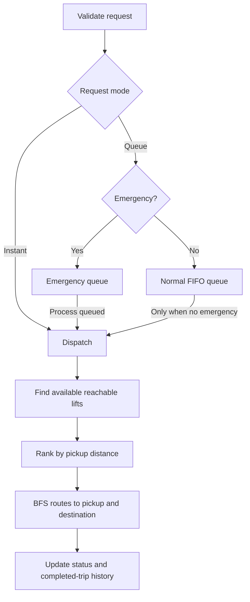

# Smart Elevator Dispatch System

A C simulation using BFS routing, circular FIFO and emergency queues, a request-ID hash table, a linked list of completed trips, linear candidate filtering, and Bubble Sort.

## Architecture



The building has floors 0-10 and three elevators. E1 and E3 serve adjacent floors; express E2 connects 0, 5, and 10. Each elevator has a separate adjacency matrix. Dispatch checks availability and BFS reachability for both trip legs, then selects the eligible lift nearest the pickup floor.

## Data Structures

| Structure | Purpose |
| --- | --- |
| `Elevator` | ID, current floor, capacity/load, express type, availability |
| `Request` | Unique ID, pickup/destination floors, priority (1 emergency, 0 normal) |
| `Queue` | Fixed-size circular FIFO for normal requests |
| `PriorityQueue` | Fixed-size emergency buffer; processed before normal calls |
| `routeGraph` | Per-elevator adjacency matrix; 1 indicates a direct floor connection |
| `Candidate` | Elevator index and pickup distance for sorting |
| `RequestHashTable` | 31 buckets with separate chaining; looks up each request by ID and stores its lifecycle status |
| `CompletedRequestList` | Singly linked list, appended in trip-completion order |

Constants: `NUM_FLOORS = 11`, `NUM_ELEVATORS = 3`, `MAX_QUEUE = 20`. Local edges connect consecutive floors bidirectionally. Express edges connect 0-5 and 5-10 bidirectionally. Graph diagonal entries allow a route from a floor to itself.

## Inputs and Menu

Floors must be in 0-10, pickup and destination must differ, and priority must be 0 or 1. Input is checked for numeric values and invalid trailing input is cleared.

1. Request an instant ride.
2. Queue a normal or emergency request.
3. Process the next queued request (emergency first; normal requests remain FIFO).
4. Display elevator and queue status.
5. View building and route information.
6. Look up request status by ID using the hash table.
7. Display completed-trip history using the linked list.
8. Exit and free dynamically allocated tracking/history nodes.

Queue-full requests are rejected and marked as such in the request table. Requests that cannot currently be served are retained with an unserved status.

## Request Processing

1. A request receives a monotonically increasing ID and is entered in the hash table.
2. Instant requests dispatch immediately. Queued requests enter the normal circular FIFO or emergency buffer.
3. `findBestElevator()` skips busy lifts and uses `findShortestPath()` to test current-floor-to-pickup and pickup-to-destination reachability.
4. Eligible lifts are ranked by absolute floor distance using `sortCandidates()` (Bubble Sort).
5. BFS reconstructs both routes. On success, the elevator moves to the destination and the request is appended to completed history.
6. Menu option 6 searches request records by ID; option 7 traverses and prints the completed-trip list.

## Output Example

```text
>>> DISPATCHING NORMAL REQUEST #1 <<<
Passenger Request: Floor 2 to Floor 7
Selected Elevator : E1 (Local Lift)
Starting Location : Floor 0
Selection Reason  : Closest available lift (2 floors away)
[Step 1] Route: Floor 0 -> Floor 1 -> Floor 2
[Step 2] Route: Floor 2 -> Floor 3 -> Floor 4 -> Floor 5 -> Floor 6 -> Floor 7
[Result] Trip complete! Elevator E1 is now free at Floor 7.
```

Status output lists each lift's type, floor, capacity, availability, and waiting queue counts. Emergency dispatch prints an immediate-response alert. Express routes traverse only their hubs (for example, Floor 5 -> Floor 10).

## Complexity

Let $V=11$ floors, $E$ graph edges, $K=3$ elevators, $M\le20$ emergency requests, and $R$ tracked requests.

| Operation | Time | Extra space |
| --- | --- | --- |
| Normal enqueue/dequeue | $O(1)$ | $O(1)$ |
| Emergency insert/extract | $O(1)$ / $O(M)$ | $O(1)$ |
| BFS route | $O(V+E)$ | $O(V)$ |
| Candidate Bubble Sort | $O(K^2)$ | $O(1)$ |
| Elevator selection | $O(K(V+E)+K^2)$ | $O(V)$ |
| Hash-table request lookup | Average $O(1)$, worst $O(R)$ | $O(R)$ stored records |
| Append / traverse completed history | $O(1)$ / $O(C)$ | $O(C)$ for $C$ completed trips |

Queues and the route graph use bounded arrays. Request tracking and completed-trip history use dynamically allocated nodes, which are freed on exit.

## Build and Run

```bash
gcc -Wall -Wextra smart_elevator_dispatch.c -o smart_elevator_dispatch
./smart_elevator_dispatch
```