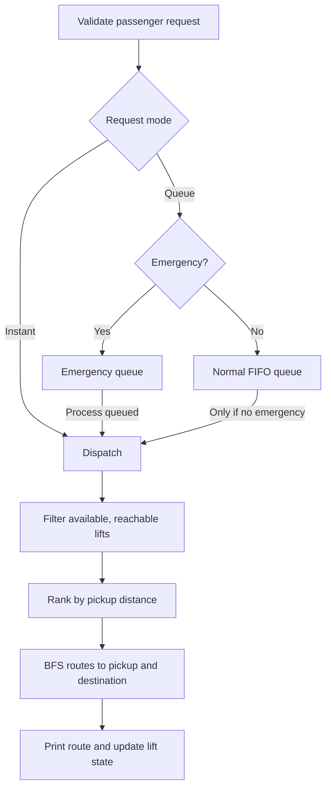
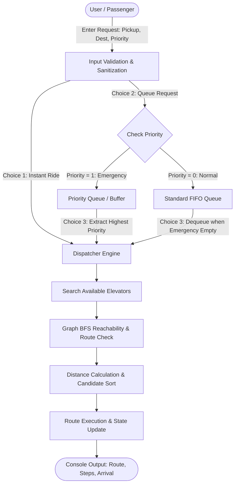

# Smart Elevator Dispatch System

A C simulation combining graph BFS routing, a circular FIFO queue, an emergency priority queue, linear candidate filtering, and Bubble Sort.

## Architecture



The building has floors 0-10 and three lifts: E1 and E3 serve adjacent floors; E2 is express and connects floors 0, 5, and 10. Each lift has a separate adjacency matrix. Dispatch checks lift availability and BFS reachability for both trip legs, then selects the eligible lift nearest the pickup floor.

## Data Structures

| Structure | Fields / purpose |
| --- | --- |
| `Elevator` | `id`, `currentFloor`, `capacity`, `currentLoad`, `isExpress`, `available` |
| `Request` | Unique `requestId`, `pickupFloor`, `destFloor`, `priority` (1 emergency, 0 normal) |
| `Queue` | `Request items[MAX_QUEUE]`, `front`, `rear`, `count`; circular FIFO for normal calls |
| `PriorityQueue` | `Request items[MAX_QUEUE]`, `size`; emergency calls are extracted first |
| `Candidate` | `elevatorIndex` and pickup `distance`; separates ranking from lift state |
| `routeGraph` | `routeGraph[NUM_ELEVATORS][NUM_FLOORS][NUM_FLOORS]`; 1 means a direct connection |

Constants: `NUM_FLOORS = 11`, `NUM_ELEVATORS = 3`, `MAX_QUEUE = 20`. Local lift edges are bidirectional between consecutive floors. Express edges are bidirectional between 0-5 and 5-10. Diagonal graph entries allow a route from a floor to itself.

## Inputs and Validation

| Input | Valid values | Validation |
| --- | --- | --- |
| Menu option | Integer 1-6 | Reject nonnumeric or out-of-range input |
| Pickup / destination | Floors 0-10 | Reject out-of-range floors and identical pickup/destination |
| Priority | 0 or 1 | 0 is normal; 1 is emergency |

Input handling clears remaining characters from `stdin` after reads so invalid text does not repeat indefinitely. Errors are reported and control returns to the menu.

## Request Lifecycle

1. **Create:** Option 1 dispatches immediately. Option 2 assigns a monotonically increasing request ID and inserts into the normal circular queue or emergency buffer.
2. **Schedule:** Option 3 extracts an emergency first; a normal request is dequeued only when no emergencies are waiting. Normal requests retain FIFO order. Queue-full insertions print a notice.
3. **Select:** `findBestElevator()` skips busy lifts and uses `findShortestPath()` to check current-floor-to-pickup and pickup-to-destination reachability. Eligible lifts are recorded as candidates.
4. **Rank:** `sortCandidates()` bubble-sorts by absolute floor distance from lift to pickup. The nearest eligible lift is selected. If none can serve the trip, a notice is printed.
5. **Route and update:** BFS reconstructs both paths. The simulation prints pickup and destination routes, boards/exits the passenger, sets the lift's floor to the destination, and marks it available.

## Output

The status table shows lift ID, local/express type, current floor, capacity, availability, and counts of waiting emergency and normal requests. Dispatch output includes request type/ID, floors, selected lift, starting location, selection rationale, each route, and completion status. Emergency output includes an immediate-response alert.

```text
>>> DISPATCHING NORMAL REQUEST #1 <<<
Passenger Request: Floor 2 to Floor 7
Selected Elevator : E1 (Local Lift)
Starting Location : Floor 0
Selection Reason  : Closest available lift (2 floors away)

[Step 1] Route: Floor 0 -> Floor 1 -> Floor 2
  Arrived at Floor 2. Passenger boarded.
[Step 2] Route: Floor 2 -> Floor 3 -> Floor 4 -> Floor 5 -> Floor 6 -> Floor 7
  Arrived at Floor 7. Passenger exited.
[Result] Trip complete! Elevator E1 is now free at Floor 7.
```

Express routes traverse hubs, for example Floor 5 -> Floor 10. Emergency requests are processed ahead of waiting normal requests.

## Complexity

Let $V=11$ floors, $E$ graph edges, $K=3$ lifts, and $M\le20$ emergency requests.

| Operation | Time | Extra space |
| --- | --- | --- |
| Normal queue enqueue / dequeue | $O(1)$ | $O(1)$ |
| Emergency insert / extract | $O(1)$ / $O(M)$ (array shift) | $O(1)$ |
| BFS route (`findShortestPath`) | $O(V+E)$ | $O(V)$ |
| Candidate Bubble Sort | $O(K^2)$ | $O(1)$ |
| Elevator selection | $O(K(V+E)+K^2)$ | $O(V)$ |

The program uses bounded static arrays and no `malloc`/`free` allocations.

## 1. System Architecture Overview

The system models a multi-elevator building scheduling environment using classic Data Structures and Algorithms:
- **Graph Theory & Breadth-First Search (BFS)** for modeling building topologies and routing.
- **First-In, First-Out (FIFO) Circular Queue** for fair scheduling of normal requests.
- **Priority Queue** for emergency preemptive dispatching.
- **Linear Filtering & Bubble Sort** for evaluating and ranking elevator dispatch candidates.



---

## 2. Core Data Models

The program models both the physical entities (elevators, passengers) and the scheduling mechanisms (graphs, queues) using standard C structures and arrays.

### 2.1. `Elevator`
Represents the state of an individual elevator cab in the building fleet.

```c
typedef struct {
    int id;                 // Identifier: 1, 2, 3
    int currentFloor;       // Current location (0 to 10)
    int capacity;           // Maximum rated passenger capacity
    int currentLoad;        // Current passenger count
    bool isExpress;         // true = Express lift, false = Local lift
    bool available;         // true = Available/Idle, false = Busy
} Elevator;
```

- **Role**: Tracks physical location and capability.
- **Distinction**: `isExpress` differentiates lifts that stop at every floor versus those limited to designated express hubs.

---

### 2.2. `Request`
Represents a passenger call from one floor to another.

```c
typedef struct {
    int requestId;          // Monotonically increasing unique ID
    int pickupFloor;        // Origin floor (0 to 10)
    int destFloor;          // Destination floor (0 to 10)
    int priority;           // 1 = Emergency (Fire/Medical), 0 = Normal
} Request;
```

- **Role**: Encapsulates travel requirements and urgency level.

---

### 2.3. `Queue` (Circular FIFO Queue)
Buffers standard requests to maintain first-come, first-served fairness.

```c
typedef struct {
    Request items[MAX_QUEUE];
    int front;
    int rear;
    int count;
} Queue;
```

- **Mechanism**: Implements circular array indexing (`(rear + 1) % MAX_QUEUE`).
- **Why Circular**: Prevents memory drift / array shifting overhead, giving strict $O(1)$ enqueue and dequeue operations without dynamic memory fragmentation.

---

### 2.4. `PriorityQueue` (Emergency Queue)
Dedicated buffer reserved for emergency/critical calls.

```c
typedef struct {
    Request items[MAX_QUEUE];
    int size;
} PriorityQueue;
```

- **Mechanism**: High-priority requests are stored separately. During dispatching, the dispatcher unconditionally drains this queue before checking the standard FIFO queue.

---

### 2.5. Graph Adjacency Matrix (`routeGraph`)
A 3D array modeling the topological graph of the building for each elevator:

```c
int routeGraph[NUM_ELEVATORS][NUM_FLOORS][NUM_FLOORS];
```

- **Dimension 1 (`NUM_ELEVATORS = 3`)**: Each elevator possesses its own distinct transit graph.
- **Dimension 2 & 3 (`NUM_FLOORS x NUM_FLOORS = 11 x 11`)**: Adjacency matrix where `routeGraph[e][u][v] = 1` indicates lift `e` can move directly between floor `u` and floor `v`.

#### Elevator Topologies:
- **E1 & E3 (Local Lifts)**: Bidirectional edges between all consecutive floors:
  $$\forall f \in [0, 9], \quad (f \leftrightarrow f+1)$$
- **E2 (Express Lift)**: Only connects major express hubs:
  $$(0 \leftrightarrow 5) \quad \text{and} \quad (5 \leftrightarrow 10)$$

---

### 2.6. `Candidate`
Temporary record used during elevator evaluation and sorting.

```c
typedef struct {
    int elevatorIndex;      // Index in fleet array (0, 1, or 2)
    int distance;           // |currentFloor - pickupFloor|
} Candidate;
```

- **Role**: Keeps candidate scores separated from the main elevator fleet array, preventing destructive side-effects during sorting.

---

## 3. Inputs and Outputs Analysis

### 3.1. Input Specifications

| Input | Type / Range | Validation Rule | Error Feedback |
| :--- | :--- | :--- | :--- |
| **Menu Option** | Integer: `1 - 6` | Must be numeric; within `[1, 6]` | `[ERROR] Invalid input!` or `Choice out of range!` |
| **Pickup Floor** | Integer: `0 - 10` | $0 \le \text{pickup} \le 10$ | `[ERROR] Invalid floor! Must be between 0 and 10.` |
| **Destination Floor** | Integer: `0 - 10` | $0 \le \text{dest} \le 10$ and $\text{dest} \ne \text{pickup}$ | `[ERROR] You are already on Floor X!` |
| **Priority** | Integer: `0` or `1` | Must be exactly `0` (Normal) or `1` (Emergency) | `[ERROR] Invalid priority! Enter 1 or 0.` |

> **Note on Buffer Safety**: All inputs use `clearInputBuffer()` to flush extra characters and newlines from `stdin`. This prevents infinite loops if non-numeric characters (e.g., letters) are typed.

---

### 3.2. Output Specifications

The system output is structured into four primary formats:

#### 1. Elevator Status Table
Displays the fleet state in human-readable columns:
```text
=================================================================
                      ELEVATOR FLEET STATUS                      
=================================================================
Lift   | Type       | Current Floor   | Capacity     | Status    
-----------------------------------------------------------------
E1     | Local      | Floor 0         | 8 persons   | Available 
E2     | Express    | Floor 5         | 12 persons   | Available 
E3     | Local      | Floor 10        | 8 persons   | Available 
=================================================================
Queue Status: 0 Emergency waiting, 0 Normal waiting
```

#### 2. Dispatch Rationale & Route Walkthrough
Explains which lift was selected, why, and traces the step-by-step path:
```text
----------------------------------------------------
>>> DISPATCHING NORMAL REQUEST #1 <<<
Passenger Request: Floor 2 to Floor 7
----------------------------------------------------
Selected Elevator : E1 (Local Lift)
Starting Location : Floor 0
Selection Reason  : Closest available lift (2 floors away)

[Step 1] Elevator moving to pick up passenger:
  Route: Floor 0 -> Floor 1 -> Floor 2
  Status: Arrived at Floor 2. Passenger boarded.

[Step 2] Elevator traveling to destination:
  Route: Floor 2 -> Floor 3 -> Floor 4 -> Floor 5 -> Floor 6 -> Floor 7
  Status: Arrived at Floor 7. Passenger exited.

[Result] Trip complete! Elevator E1 is now free at Floor 7.
----------------------------------------------------
```

#### 3. Express Route Traversal
Demonstrates the express hop capabilities:
```text
Selected Elevator : E2 (Express Lift)
Starting Location : Floor 5
Selection Reason  : Closest available lift (0 floors away)

[Step 2] Elevator traveling to destination:
  Route: Floor 5 -> Floor 10
  Status: Arrived at Floor 10. Passenger exited.
```

#### 4. Priority Queue Alert & Dispatch Override
Notifies users when an emergency jumps ahead of standard queue entries:
```text
[PRIORITY QUEUE] Processing HIGH-PRIORITY Emergency Request #2 ahead of normal queue!
----------------------------------------------------
>>> DISPATCHING EMERGENCY REQUEST #2 <<<
Priority Alert: Immediate response required for Floor 8!
Passenger Request: Floor 8 to Floor 9
----------------------------------------------------
```

---

## 4. End-to-End Processing: How Input Becomes Output

The transformation from user keystrokes to the final execution trace follows four distinct stages:

```
[Stage 1: Ingestion & Validation]
               │
               ▼
[Stage 2: Scheduling & Queue Routing]
               │
               ▼
[Stage 3: Elevator Selection & BFS Routing]
               │
               ▼
[Stage 4: State Transition & Output Rendering]
```

### Stage 1: Ingestion & Validation
1. The user selects a menu option and inputs parameters via `scanf`.
2. Floor bounds $[0, 10]$ and differentiation (`pickup != dest`) are verified.
3. If input fails validation, an informative error message is displayed, the buffer is cleared, and control returns safely to the menu without system crashes.

### Stage 2: Scheduling & Queue Routing
- **If Option 1 (Instant Ride)** is selected: Bypasses queues and directly invokes `serveRequest()`.
- **If Option 2 (Queue Request)** is selected:
  - If `priority == 1`, stored in `emergencyQueue` via `insertEmergency()`.
  - If `priority == 0`, stored in `normalQueue` via `enqueueNormal()`.
- **If Option 3 (Process Queued Request)** is selected:
  - Evaluates `isPriorityQueueEmpty(&emergencyQueue)`. If false, calls `extractEmergency()`.
  - Otherwise, calls `dequeueNormal()`.

### Stage 3: Elevator Selection & BFS Routing
When `serveRequest()` is called:
1. Calls `findBestElevator()`:
   - Iterates through the fleet (`i = 0` to `NUM_ELEVATORS - 1`).
   - Ignores elevators that are `!available`.
   - **BFS Reachability Check**: Calls `findShortestPath()` twice:
     - Check 1: Can lift `i` navigate from `elevators[i].currentFloor` to `pickupFloor`?
     - Check 2: Can lift `i` navigate from `pickupFloor` to `destFloor`?
   - If both checks return `true`, lift `i` is added to the `eligible[]` candidate array with distance:
     $$\text{distance} = |\text{currentFloor} - \text{pickupFloor}|$$
2. **Candidate Ranking**:
   - Calls `sortCandidates()` which executes a Bubble Sort on the `eligible` array ordered by `distance` ascending.
   - Selects `eligible[0].elevatorIndex`.

### Stage 4: State Transition & Output Rendering
1. The full paths are reconstructed using BFS:
   - `toPickupPath`: Sequence of floors from elevator's starting position to passenger pickup.
   - `toDestPath`: Sequence of floors from pickup to destination.
2. The UI outputs the route sequence with arrows (`Floor A -> Floor B -> ...`).
3. State mutation:
   - `e->currentFloor = req.destFloor;`
   - `e->available = true;`
4. The system is ready for the next iteration.

---

## 5. Algorithmic Complexity Analysis

| Operation / Function | Algorithm | Time Complexity | Space Complexity | Notes |
| :--- | :--- | :--- | :--- | :--- |
| **Normal Queue Enqueue / Dequeue** | Circular Array FIFO | $\mathcal{O}(1)$ | $\mathcal{O}(1)$ | Constant time index updates |
| **Emergency Insert** | Append to array | $\mathcal{O}(1)$ | $\mathcal{O}(1)$ | Constant time buffer insert |
| **Emergency Extract** | Shift array elements | $\mathcal{O}(M)$ | $\mathcal{O}(1)$ | $M \le 20$ (queue capacity) |
| **Route Generation** (`findShortestPath`) | Graph BFS Traversal | $\mathcal{O}(V + E)$ | $\mathcal{O}(V)$ | $V = 11$ floors, $E \le 20$ edges |
| **Candidate Ranking** (`sortCandidates`) | Bubble Sort | $\mathcal{O}(K^2)$ | $\mathcal{O}(1)$ | $K = 3$ elevators |
| **Full Dispatch Selection** (`findBestElevator`) | Linear Scan + 2 BFS + Sort | $\mathcal{O}(K \cdot (V + E) + K^2)$ | $\mathcal{O}(V)$ | Negligible runtime (<1 ms) |

All algorithms operate within tightly bounded, static memory constraints with zero dynamic allocations (`malloc`/`free`), eliminating memory leak hazards.

---

